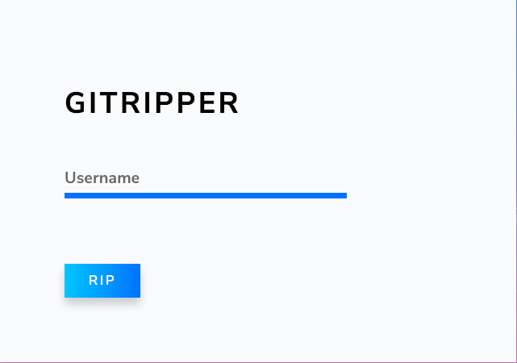

# Gitripper

_Rip User Data from Github_

```
       _ _        _
      (_) |      (_)
  __ _ _| |_ _ __ _ _ __  _ __   ___ _ __
 / _` | | __| '__| | '_ \| '_ \ / _ \ '__|
| (_| | | |_| |  | | |_) | |_) |  __/ |
 \__, |_|\__|_|  |_| .__/| .__/ \___|_|
 __/ |            | |   | |
 |___/            |_|   |_|
```




[Visit Here](gitripper.generaljs.org)


### Setup

* `npm install -g yarn`

* Clone Repository, `cd gitripper`

* `yarn install`

### Development

* `yarn start` to start local development server.

* `yarn build` to create production builds.

* `yarn deploy` to deploy to Github Pages.


_Made with Redux Powered by [Shinobi](https://github.com/rajatsharma305/shinobi)_
